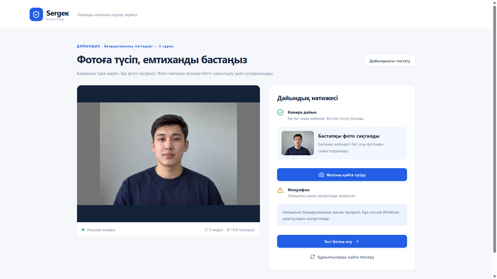
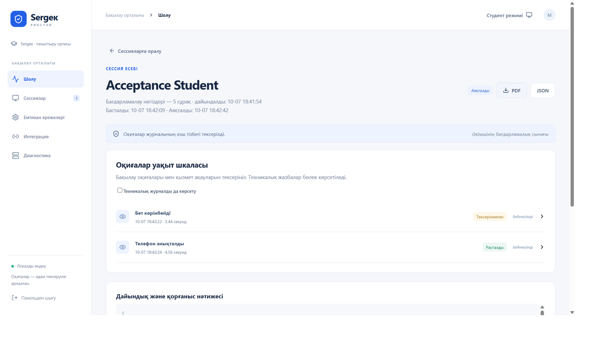

# Sergек Proctor

**Локальный прокторинг и защищённая среда экзамена для университетов**  
**Университеттерге арналған локалды прокторинг және қорғалған емтихан ортасы**

Windows x64. Команда **Sergек**, Astana IT University.  
Кейс №3: «Локальный прокторинг: защита браузера, контроль взгляда и обнаружение смартфонов». **Qostanai AI Industry Hackathon 2026**.

[На русском языке](#на-русском-языке) · [Қазақ тілінде](#қазақ-тілінде)

## На русском языке

### 1. О проекте

Sergек объединяет защищённый экзаменационный браузер, локальный анализ камеры и микрофона, контроль Windows и кабинет преподавателя. Студент сдаёт привычный тест в Moodle. Преподаватель получает события с временем, фрагментами камеры и экрана, звуком и возможностью принять решение по каждому эпизоду.

Нейросети работают на компьютере студента. Университет может разместить хаб на своей инфраструктуре и управлять доступом к доказательствам. Вопросы, ответы и оценки остаются в Moodle. Sergек отвечает за условия прохождения экзамена и материалы для проверки.

Целевой сценарий: компьютерные аудитории и контролируемые экзамены Ахмет Байтұрсынұлы атындағы Қостанай өңірлік университеті. Это предложение для пилота по кейсу КРУ и Qostanai Hub. Внедрение в университет ещё не проводилось. Команда разработчиков учится в Astana IT University.



**Удобный интерфейс на трёх языках:** пользователь выбирает **қазақша / русский / English** в верхней части окна. Переведены страницы студента и преподавателя, кнопки, инструкции, статусы, названия событий и основные сообщения об ошибках. Выбор сохраняется на этом устройстве после перезапуска. Переключение происходит сразу, без повторного входа, потери введённых данных или остановки открытой сессии. PDF-отчёт преподавателя скачивается на выбранном языке. Имена, комментарии, wэкзаменационные вопросы и технические коды не переводятся автоматически; язык содержимого Moodle/Platonus задаётся самой учебной платформой.

### 2. Проблема и решение

Во время онлайн-теста студент может читать подсказки с телефона, привлекать другого человека, открывать посторонние программы или пользоваться удалённой помощью. Камера не предотвращает действия в операционной системе. Слишком чувствительные уведомления перегружают преподавателя и могут создавать необоснованные подозрения.

| Риск | Действие Sergек | Результат |
|---|---|---|
| Телефон перед камерой | Анализ полного кадра и увеличенных областей, проверка устойчивости сигнала | Эпизод с камерой, экраном и временем |
| Подмена или второй человек | Сравнение с начальным фото, подсчёт лиц и контроль отсутствия | Материал для проверки личности |
| Длительный взгляд в сторону/вниз | Оценка положения головы и глаз, порог длительности | Наблюдение с контекстом |
| Продолжительная речь, сильный шум | Локальный анализ звука и голосовой активности | Прослушиваемый аудиофрагмент |
| Посторонние окна, USB, клавиши, remote control | Защищённый браузер и Windows-модуль применяют политику | Ограничение действий и технический аудит |
| Спорный эпизод | Контекст до/после события и отдельное решение преподавателя | Проверяемое доказательство |

Система разделяет **наблюдения за студентом** и **технические действия защиты**. Заблокированный сайт или закрытая программа не означают, что студент использовал запрещённый ресурс. Короткие звуки и случайные движения не становятся автоматическим обвинением. Окончательное решение принимает преподаватель.

Телефон в верхней части кадра может указывать на попытку сфотографировать монитор. Одна веб-камера не доказывает направление камеры телефона или факт съёмки. Взгляд и голос также не доказывают списывание сами по себе.

### 3. Как проходит экзамен

1. Студент входит в **Moodle внутри Sergек** своим аккаунтом и выбирает тест.
2. Плагин автоматически передаёт подписанные данные пользователя и экзамена. Повторно вводить ссылку, имя или выбирать режим не нужно.
3. Студент даёт согласие на контроль, проверяет оборудование и делает **одну начальную фотографию**. Обязательных поворотов головы и трёхшагового задания на движения нет.
4. Переходит к странице теста. **Защита Windows и запись экзамена начинаются при нажатии Moodle «Start attempt» / «Continue your attempt»**, после подтверждения готовности. Предварительная работа камеры и микрофона не означает начало экзамена.
5. Отвечает на вопросы в защищённом окне. База сохраняет фактическое время начала в UTC.
6. Отправляет ответы через Moodle. Сигнал завершения закрывает сессию, сохраняет время окончания и освобождает ограничения. При потере обратного сигнала агент дополнительно проверяет состояние попытки на сервере.

Преподаватель заранее задаёт политику. Пароль преподавателя защищает административный кабинет, студент при запуске экзамена его не вводит.

### 4. Камера, личность и микрофон

**Телефон:** YOLO11s в ONNX Runtime работает локально на CPU, использует масштабы 640/960 и увеличенные области. Порог уверенности по умолчанию 0,30. Событие требует нескольких свежих обнаружений и примерно двух секунд устойчивого сигнала. Повторы объединяются. Маленький, закрытый или плохо освещённый телефон может остаться незамеченным.

**Лицо:** YuNet и SFace сравнивают текущую личность с начальным фото. Некачественный кадр не должен автоматически превращаться в вывод о подмене. MediaPipe отслеживает присутствие человека, количество лиц и направление головы/глаз. Пороги по умолчанию: длительный взгляд восемь секунд, отсутствие три секунды, второе лицо полторы секунды. Политика допускает работу с бумагой.

**Подмена фото/видео:** MiniFASNetV2 и MiniFASNetV1SE выполняют пассивную оценку признаков неживого лица. Она дополняет проверку личности. Защита от любых распечаток, экранов, записей и deepfake не сертифицирована.

**Звук:** микрофон передаёт PCM в локальный анализ, Silero VAD обнаруживает голосовую активность. Правила учитывают длительность и уровень, отделяют продолжительный голос/шум от коротких звуков. Преподаватель слушает WAV-доказательство. Система не распознаёт слова и не передаёт аудио облачному сервису расшифровки.

Захват камеры, AI и предпросмотр работают в отдельных потоках. Медленный анализ не создаёт очередь старых кадров и не должен замораживать изображение.

### 5. Защита Windows и восстановление

| Уровень | Реализация |
|---|---|
| Браузер | Разрешённые домены, запрет новых окон и внешних переходов, ограничения печати, скачивания и буфера обмена по политике |
| Клавиатура | Native hook ограничивает Alt+Tab, Win, PrtScn и запрещённые комбинации. Копирование/вставка зависят от политики |
| Приложения | Закрывает посторонние видимые окна и запрещённые фоновые процессы, сохраняет критические процессы Windows и Sergек |
| USB | Политика запрета доступа к накопителям, мониторинг подключений, проверка доступности томов |
| Удалённая помощь | Проверка RDP, временное ограничение служб и известных программ remote control |
| Экран | Проверка мониторов, защита окна от обычного захвата Windows, собственные доверенные кадры экзамена для доказательств |
| Восстановление | Возврат прежнего состояния после завершения. Независимый heartbeat и аварийный выход при сбое |

Для системных ограничений нужны права администратора. **Ctrl+Alt+F12** служит аварийным восстановлением. Обычные hooks не блокируют Ctrl+Alt+Del. USB, драйверы, secure desktop, мониторы и возврат состояния служб требуют физической приёмки на университетских компьютерах. Локальный администратор и изменённая ОС находятся вне гарантируемого периметра защиты.

### 6. Доказательства и кабинет преподавателя

По умолчанию событие сохраняет **пять секунд до и пять после**: кадры камеры, отдельные кадры экрана, время и доступный аудиофрагмент. Доказательства используют камеру до 8 кадров/с и экран до 5 кадров/с. Это архив последовательности изображений с WAV, который интерфейс воспроизводит как видео. Непрерывная запись всего экзамена в MP4 не ведётся.

Архивы защищает **AES-GCM**, ключ на Windows защищает **DPAPI**. Цепочка **SHA-256** позволяет обнаружить изменения в записях событий, но не заменяет независимую доверенную подпись сервера. Срок хранения по умолчанию 14 дней, его меняет университет.



Преподаватель входит в защищённый кабинет, находит экзамен, открывает временную шкалу, смотрит камеру и экран, слушает звук, подтверждает или отклоняет эпизод и оставляет комментарий. Исходное событие сохраняется отдельно от решения. Доступны остановка сессии, удаление материалов и **PDF/JSON** с фактическим началом и завершением. Sergек не выставляет оценки и не объявляет студента виновным автоматически.

### 7. Архитектура и технология разработки

| Компонент | Технологии | Назначение |
|---|---|---|
| `ui/` | React, TypeScript, Vite | Подготовка, сессия, кабинет преподавателя |
| `desktop/` | Electron | Защищённый браузер, sandbox, context isolation и IPC |
| `backend/` | Python 3.12, FastAPI, OpenCV, ONNX Runtime, MediaPipe | API, AI, звук, временные правила и доказательства |
| `guard/` | C#, .NET 8, Windows hooks/WMI | Ограничения ОС и восстановление |
| Хранилище | SQLite WAL, AES-GCM, DPAPI | Сессии, UTC-время, журнал, шифрованные доказательства |
| `moodle/quizaccess_sergek/` | PHP, Moodle access rule | Подписанный запуск, серверный допуск и завершение |
| `lab/` | Moodle 4.5.15, PHP, MariaDB, HTTPS | Изолированная лаборатория с реальной LMS |
| `scripts/`, `tests/` | pytest, Node.js, Playwright | Сборка, проверки, нагрузка, демонстрация |

```text
Студент: Electron + локальный AI + Windows guard + SQLite
                      ↕ HTTPS
Университет: Moodle / quizaccess_sergek + хаб + кабинет преподавателя
```

Плагин связывает запуск с конкретным пользователем и тестом. Подготовленная сессия отличается от активной. Сервер допускает попытку после подтверждения контроля. Хаб проверяет **HMAC, время и nonce**, отклоняет повторные пакеты и передаёт команды преподавателя. HTTPS проверяет сертификат.

Экзаменационная страница не получает Node.js-доступ. Guard общается через stdin/stdout, без открытого TCP-порта. GPU не обязателен. Локальный анализ работает без облачного AI, но Moodle и хаб требуют сети.

В `package-lock.json` и `backend/requirements-build.lock.txt` закреплены зависимости, в `models/manifest.json` источники и SHA-256 моделей. Внешние авторы предварительно обучили модели. Команда разработала интеграцию, правила, защиту, хранилище, интерфейс и тестовый контур. Для помощи с кодом, отладкой и документацией использовался **OpenAI Codex**, для иллюстраций и демо-портрета **OpenAI image generation**. Демонстрационные изображения не являются данными реальных студентов.

### 8. Отличия от OES и других решений

Источники сравнения: предоставленная презентация OES, официальные описания [OES](https://oes.kz/) и [Safe Exam Browser](https://safeexambrowser.org/about_overview_en.html), проверенные 7 октября 2026 года. Это сравнение подходов. Независимого испытания одинаковых экзаменов не проводили.

| Вопрос | OES | Safe Exam Browser | Sergек |
|---|---|---|---|
| Основной подход | Сервис AI-прокторинга с desktop-модулем | Защищённая экзаменационная среда | Локальный AI, Windows-защита и проверка эпизодов |
| Размещение | Сайт описывает аренду с серверами | Локальный клиент и опциональный собственный сервер | AI на компьютере, хаб у университета |
| Анализ поведения | Заявлены лицо, звук, антиспуфинг | Не основная задача базового браузера | Телефон, лицо, взгляд и звук с временными правилами |
| Защита рабочего места | Есть desktop-контроль, remote control и USB detection | Клавиши, приложения и URL-фильтры | Браузер и native guard, политика USB и восстановление |
| Материалы преподавателю | Мониторинг и аналитические отчёты | Зависят от подключённого прокторинга | Контекст эпизода, камера/экран/звук, решение, PDF/JSON |

**Сильные стороны Sergек для этого кейса:** локальный анализ, управляемое размещение данных, обнаружение телефона вместе с защитой рабочего места, отдельный технический аудит, контекст до/после события, запуск из штатной попытки Moodle и открытый код с воспроизводимыми проверками. Университет может адаптировать правила под свою аудиторию.

Камера, микрофон, антиспуфинг, desktop-контроль и интеграции уже встречаются у других продуктов. Мы не называем их уникальными. OES предлагает мобильные клиенты, дополнительную камеру и свой конструктор тестов. Sergек пока этого не реализует. «Sergек точнее или масштабнее OES» не подтверждено сравнительным испытанием.

### 9. Проверенные результаты и границы

| Проверка | Результат | Условия |
|---|---|---|
| Автотесты | **67 Python + 13 desktop + 6 browser** прошли | Конкретные правила, API, защитные условия и жизненный цикл |
| Реальный Moodle + собранный Electron | Вход, выбор, подготовка, 5 вопросов, отправка и завершение прошли | Moodle 4.5.15, административный профиль без камеры и ограничений ОС |
| Открытие первой задачи | **2584 мс** после Start attempt | Один замер того же интеграционного профиля |
| Физическая камера и аудио | Медиана **28,55 кадра/с**, AI 9,55 проверок/с, экран 5 кадров/с, потерь аудио 0 | 20 секунд, без идентификации и ограничений ОС |
| Хаб | **200 синтетических клиентов, 5000 запросов, 0 ошибок** | Короткий тест HTTPS-пакетов, не 200 реальных видеопотоков. p95 ingest 1,93 с, status 2,67 с |
| Телефон | Обнаружены 4/5 выбранных изображений, 0 срабатываний на 121 отрицательном примере | Небольшая выборка, не общая оценка точности |
| Пассивная проверка живого лица | Три размеченных примера | Не сертифицирует защиту от всех фото/видео атак |
| Минутное демо | Реальный интерфейс, Moodle, AI-событие, экран, решение и PDF | Камера получает тестовые кадры. Ограничения ОС отключены только для записи |

Проверка трёх языков: **67 Python, 13 desktop и 6 browser тестов прошли**; переключение во время экзамена и сохранение языка после перезапуска проверены в Windows-сборке. [Проверка трёх языков](VALIDATION-1.4.3.md).

Детали: [Проверка запуска и стабильности](VALIDATION-1.4.2.md), [Проверка нагрузки и моделей](VALIDATION-1.4.0.md), [Приёмочная проверка](docs/ACCEPTANCE.md). Машинные результаты: `tests/moodle-fast-v142.json`, `tests/hub-load-v140.json`, `tests/vision-v140.json`.

**Moodle проверен локально.** Platonus предусмотрен как подключение через защищённый браузер. Университетские SSO, API оценок и автоматическое завершение Platonus не проверены. Для внедрения нужны тестовые аккаунты и университетская приёмка. Мобильные клиенты, вторая камера и защита от администратора ОС отсутствуют. Частота кадров и точность зависят от оборудования и условий.

### 10. Запуск, добавление теста и внедрение

**Требования:** Windows x64, веб-камера, микрофон, один монитор. Полная защита требует прав администратора. Для сборки нужны Python **3.12 x64**, Node.js **22**, **.NET 8 SDK**. Первичная установка лаборатории и зависимостей требует интернета.

Из каталога проекта:

```powershell
.\scripts\Setup-Dev.ps1
.\scripts\Build-Windows.ps1 -Installer
.\lab\Start-Lab.ps1
.\Start-Sergek-Demo.cmd
```

Если приложение установлено и лаборатория готова, достаточно `Start-Sergek-Demo.cmd`. Windows UAC разрешает системный контроль. Данные тестовых аккаунтов смотрите в **локальном файле, путь к которому выводит запуск лаборатории**. Пароли и ключи в README не публикуются.

Moodle: `https://localhost/`, хаб: `https://localhost:9443/`. Сервисы работают только на loopback. Лаборатория не устанавливает службы и не добавляет сертификат в глобальное хранилище Windows. Приложение доверяет конкретному fingerprint. Остановка: `Stop-Moodle-Lab.cmd` или `.\lab\Start-Lab.ps1 -Stop`.

**Добавление теста в Moodle:**

1. Войдите аккаунтом преподавателя из файла лаборатории, откройте курс и включите **Edit mode**.
2. Выберите **Add an activity or resource → Quiz**, задайте название, доступность, лимит и число попыток.
3. Откройте **Questions → Add** и добавьте вопросы с правильными ответами/баллами. Для импорта используйте **Question bank → Import**, Moodle XML/GIFT. Вопрос из банка нужно отдельно добавить в список Questions теста.
4. В настройках доступа включите **Require Sergek Proctor**. Для реального экзамена оставьте политику **Strict**. Профиль без системных ограничений предназначен только для программной проверки.
5. Запишите студента на курс и пройдите весь сценарий из Sergек до отправки ответов.

**Университетское подключение:**

1. Разместите `moodle/quizaccess_sergek` в `mod/quiz/accessrule/sergek` сервера Moodle, выполните plugin upgrade.
2. Подготовьте HTTPS-хаб, доступный Moodle и компьютерам аудитории. Создайте административный профиль, отдельные Moodle shared key и hub key, настройте плагин и агенты.
3. Администратор задаёт домены LMS/SSO и политику устройств. Установите приложение на Windows и включите Require Sergek Proctor в нужных тестах.
4. Проведите пилот: законное прохождение, телефон, другой человек, звук, окно, USB, клавиши, потеря связи и восстановление. Проверьте права доступа к доказательствам.

Для отдельного сервера сначала настройте кабинет desktop-приложением с тем же `SERGEK_DATA`, затем запустите HTTPS-backend. Адрес localhost студента не подходит для серверного хаба университета.

```powershell
$env:SERGEK_DATA='D:\SergekHub\data'
$env:SERGEK_MODELS='D:\SergekHub\models'
$env:SERGEK_UI='D:\SergekHub\dist'
& '.\build\backend\sergek-backend.exe' --host 0.0.0.0 --port 8765 `
  --cert 'D:\SergekHub\server.crt' --key 'D:\SergekHub\server.key'
```

Пути и CA меняются через `SERGEK_PYTHON`, `SERGEK_DATA`, `SERGEK_MODELS`, `SERGEK_UI`, `SERGEK_CA_FILE`. Рабочие базы, cookies, приватные ключи и доказательства не входят в открытый репозиторий.

**Ожидаемый эффект пилота:** меньше ручной подготовки студента, меньше технических записей в очереди нарушений, быстрее проверка эпизодов, контроль размещения данных. Это гипотезы внедрения. До/после пилота нужно измерить время подготовки и проверки, долю отклонённых AI-событий и число технических прерываний. Проценты экономии пока не измерены.

### 11. Разработка, лицензия и команда

```powershell
npm.cmd run desktop
.\.venv\Scripts\python.exe -m pip install -r tests\requirements.txt
.\.venv\Scripts\python.exe -m pytest tests -q
npm.cmd run test:desktop
npm.cmd run test:ui
node tests\languages-e2e.cjs
npm.cmd run test:electron
npm.cmd run test:moodle
```

`tests/record-demo.cjs` и `scripts/Render-Demo.py` записывают и собирают минутное демо. Камерные фикстуры включаются явно в разработке, production backend их не применяет. Условия отдельных нагрузочных и аппаратных проверок указаны в VALIDATION.

Исходный код: **AGPL-3.0-or-later**, [LICENSE](LICENSE). Модели и зависимости сохраняют собственные лицензии. Источники, назначение и условия: [THIRD_PARTY_NOTICES.md](THIRD_PARTY_NOTICES.md), `models/manifest.json`.

**Бердібек Мейірбек · Алхамқайыр Бекзат · Сабыр Аслан**  
**Astana IT University**  
Телефон: **+7 775 747 86 01**  
Email: **berdibekmejirbek08@gmail.com**

Sergек - название нашей команды и проекта. Проект не связан с коммерческой системой дорожных камер Sergek и не является её продуктом.

---

## Қазақ тілінде

### 1. Жоба туралы

Sergек қорғалған емтихан браузерін, камера мен микрофонды локалды талдауды, Windows ортасын қорғауды және мұғалім кабинетін біріктіреді. Студент Moodle-дегі қалыпты тестін тапсырады. Мұғалім оқиға уақытын, камера мен экран үзінділерін, дыбысты қарап, әр эпизод бойынша шешім қабылдайды.

Нейрожелілер студенттің компьютерінде жұмыс істейді. Университет хабты өз инфрақұрылымында орналастырып, дәлелдерге қолжетімділікті басқара алады. Сұрақтар, жауаптар және бағалар Moodle-де қалады. Sergек емтиханның өту жағдайын бақылайды және тексеруге материал береді.

Мақсатты орын: Ахмет Байтұрсынұлы атындағы Қостанай өңірлік университетінің компьютерлік аудиториялары мен бақыланатын емтихандары. Жоба ҚӨУ және Qostanai Hub ұсынған №3 кейске арналған пилоттық ұсыныс. Университетке енгізу әлі жүргізілген жоқ. Әзірлеушілер Astana IT University-де оқиды.


**Қолдануға ыңғайлы үш тілдегі интерфейс:** пайдаланушы терезенің жоғарғы жағынан **қазақша / орысша / English** тілін таңдайды. Студент пен мұғалім беттері, батырмалар, нұсқаулар, күй белгілері, оқиға атаулары және негізгі қате хабарламалары аударылған. Таңдалған тіл осы құрылғыда сақталып, қосымша қайта ашылғанда қолданылады. Тіл бірден ауысады: қайта кіру қажет емес, енгізілген деректер мен ашық сессия сақталады. Мұғалімнің PDF есебі таңдалған тілде жүктеледі. Аты-жөн, пікір, емтихан сұрақтары және техникалық кодтар автоматты аударылмайды; Moodle/Platonus ішіндегі оқу мазмұнының тілін сол платформа анықтайды.

### 2. Мәселе және шешім

Онлайн-тест кезінде студент телефоннан жауап оқуы, басқа адамнан көмек алуы, бөгде бағдарлама ашуы немесе қашықтан басқаруды пайдалануы мүмкін. Камера операциялық жүйедегі әрекеттерді шектемейді. Тым сезімтал ескертулер мұғалімнің уақытын алып, негізсіз күмән тудырады.

| Қауіп | Sergек әрекеті | Нәтиже |
|---|---|---|
| Камерадағы телефон | Толық кадр мен үлкейтілген аймақтарды талдау, сигнал тұрақтылығын тексеру | Камера, экран және уақыты бар эпизод |
| Студент ауысуы не екінші адам | Бастапқы фотомен салыстыру, бет саны мен адамның бар-жоғын бақылау | Тұлғаны тексеруге материал |
| Ұзақ жанға/төмен қарау | Бас пен көз бағытын бағалау, ұзақтық шегі | Контексті бар бақылау |
| Ұзақ сөйлеу, қатты шу | Дыбыс пен дауыс белсенділігін локалды талдау | Тыңдалатын аудиоүзінді |
| Бөгде терезе, USB, перне, қашықтан басқару | Қорғалған браузер мен Windows модулі саясатты қолданады | Әрекетті шектеу және техникалық аудит |
| Даулы эпизод | Оқиға алдындағы/кейінгі контекст, бөлек мұғалім шешімі | Қарап тексерілетін дәлел |

Жүйе **студентке қатысты бақылауларды** және **қорғаныстың техникалық әрекеттерін** бөледі. Бұғатталған сайт немесе жабылған бағдарлама студенттің тыйым салынған ресурсты қолданғанын білдірмейді. Қысқа дыбыс пен кездейсоқ қозғалыс автоматты айыптауға айналмайды. Соңғы шешімді мұғалім қабылдайды.

Кадрдың жоғарғы жағындағы телефон экранды суретке түсіру әрекетіне ұқсауы мүмкін. Бір веб-камера телефон камерасының бағытын немесе нақты фото түсірілгенін дәлелдей алмайды. Көзқарас пен дауыс та өздігінен көшіруді дәлелдемейді.

### 3. Емтихан қалай өтеді

1. Студент **Sergек ішіндегі Moodle-ге** өз аккаунтымен кіріп, тест таңдайды.
2. Плагин пайдаланушы мен емтиханның қолтаңбалы деректерін автоматты жеткізеді. Сілтеме, есім немесе режимді қайта енгізу керек емес.
3. Студент бақылауға келісім береді, құрылғыларын тексеріп, **бір бастапқы фотоға түседі**. Міндетті бас бұру мен үш қадамдық қимыл тапсырмасы жоқ.
4. Тест бетіне өтеді. **Windows қорғанысы мен емтихан жазбасы Moodle-дегі «Start attempt» / «Continue your attempt» басылғанда**, дайындық расталғаннан кейін қосылады. Оған дейін камера мен микрофонның дайын тұруы емтихан басталды дегенді білдірмейді.
5. Қорғалған терезеде сұрақтарға жауап береді. База нақты басталу уақытын UTC форматында сақтайды.
6. Moodle арқылы жауаптарын тапсырады. Аяқталу сигналы сессияны жауып, аяқталу уақытын сақтайды және шектеулерді босатады. Кері сигнал жоғалса, агент серверден әрекеттің күйін қосымша тексереді.

Мұғалім саясатты алдын ала баптайды. Мұғалім құпиясөзі әкімшілік кабинетті қорғайды, студент емтиханды бастағанда оны енгізбейді.

### 4. Камера, тұлға және микрофон

**Телефон:** YOLO11s ONNX Runtime арқылы CPU-да локалды жұмыс істейді, 640/960 өлшемдерін және үлкейтілген аймақтарды қолданады. Әдепкі сенімділік шегі 0,30. Оқиғаға бірнеше жаңа анықтау мен шамамен екі секунд тұрақты сигнал керек. Қайталанулар біріктіріледі. Ұсақ, жабылған немесе жарығы нашар телефон анықталмай қалуы мүмкін.

**Тұлға:** YuNet пен SFace ағымдағы адамды бастапқы фотомен салыстырады. Сапасыз кадр автоматты түрде тұлға ауысты деген қорытындыға айналмауы керек. MediaPipe адамның бар-жоғын, бет санын және бас/көз бағытын бақылайды. Әдепкі шектер: ұзақ көзқарас сегіз секунд, адамның болмауы үш секунд, екінші бет бір жарым секунд. Саясат қағазбен жұмыс істеуге рұқсат бере алады.

**Фото/видео арқылы алдау:** MiniFASNetV2 және MiniFASNetV1SE тірі адам орнына басқа бейне көрсетудің белгілерін пассив бағалайды. Бұл тұлға тексеруін толықтырады. Барлық қағаз фотоға, экранға, видеоға және deepfake шабуылына қорғау сертификатталған жоқ.

**Дыбыс:** микрофон PCM ағынын локалды талдауға береді, Silero VAD дауыс белсенділігін анықтайды. Ережелер ұзақтық пен деңгейді ескеріп, ұзақ дауысты/шуды қысқа дыбыстан бөледі. Мұғалім WAV дәлелін тыңдайды. Жүйе сөздерді танымайды және дыбысты бұлттағы мәтінге айналдыру сервисіне жібермейді.

Камераны түсіру, AI және алдын ала көрініс бөлек ағындарда жұмыс істейді. Баяу талдау ескі кадрлардың кезегін жинамайды және камера көрінісін тоқтатпауы керек.

### 5. Windows қорғанысы және қалпына келтіру

| Деңгей | Іске асырылуы |
|---|---|
| Браузер | Рұқсат етілген домендер, жаңа терезе мен сыртқы өтуді шектеу, саясат бойынша басып шығару, жүктеу және алмасу буферін басқару |
| Пернетақта | Native hook Alt+Tab, Win, PrtScn және тыйым салынған комбинацияларды шектейді. Көшіру/қою саясатқа байланысты |
| Бағдарламалар | Бөгде көрінетін терезелер мен тыйым салынған фондық процестер жабылады. Windows пен Sergек негізгі процестері сақталады |
| USB | Жинақтауыштарға қолжетімділікті шектеу, қосылуларды бақылау, томдардың оқылуын тексеру |
| Қашықтан көмек | RDP тексеру, қызметтер мен белгілі басқару бағдарламаларын уақытша шектеу |
| Экран | Мониторларды тексеру, Windows-тағы қалыпты экран түсіруден қорғау, дәлелге емтиханның сенімді кадрларын алу |
| Қалпына келтіру | Аяқталғанда бұрынғы күйді қайтару. Ақауда тәуелсіз heartbeat және апаттық шығу |

Жүйелік шектеулерге әкімші құқығы керек. **Ctrl+Alt+F12** апаттық қалпына келтіреді. Қалыпты hooks Ctrl+Alt+Del әрекетін бұғаттамайды. USB, драйверлер, secure desktop, мониторлар мен қызметтерді қалпына келтіру университет компьютерлерінде физикалық қабылдаудан өтуі керек. Жергілікті әкімші және өзгертілген ОС кепілдендірілген қорғау шеңберіне кірмейді.

### 6. Дәлелдер және мұғалім кабинеті

Әдепкіде оқиға **бес секунд бұрынғы және бес секунд кейінгі** контексті сақтайды: камера кадрлары, бөлек экран кадрлары, уақыт және қолжетімді аудиоүзінді. Дәлел камерасы 8 кадр/с дейін, экран 5 кадр/с дейін жұмыс істейді. Бұл интерфейс видео сияқты ойнататын суреттер мен WAV архиві. Бүкіл емтихан үздіксіз MP4 ретінде жазылмайды.

Архивтерді **AES-GCM**, Windows-та кілтті **DPAPI** қорғайды. **SHA-256** тізбегі оқиғалар жазбасының өзгергенін анықтайды, бірақ сервердің тәуелсіз сенімді қолтаңбасын алмастырмайды. Әдепкі сақтау мерзімі 14 күн, оны университет өзгертеді.


Мұғалім қорғалған кабинетке кіріп, емтиханды табады, уақыт шкаласын ашады, камера мен экранды қарайды, дыбысты тыңдайды, эпизодты растайды не жоққа шығарады және түсіндірме қалдырады. Бастапқы оқиға мен шешім бөлек сақталады. Сессияны тоқтату, материалдарды жою, нақты басталу/аяқталуы бар **PDF/JSON** есептері қолжетімді. Sergек баға қоймайды және студентті автоматты кінәлі деп жарияламайды.

### 7. Архитектура және әзірлеу технологиясы

| Компонент | Технология | Мақсаты |
|---|---|---|
| `ui/` | React, TypeScript, Vite | Дайындық, сессия, мұғалім кабинеті |
| `desktop/` | Electron | Қорғалған браузер, sandbox, context isolation және IPC |
| `backend/` | Python 3.12, FastAPI, OpenCV, ONNX Runtime, MediaPipe | API, AI, дыбыс, уақыт ережелері және дәлел |
| `guard/` | C#, .NET 8, Windows hooks/WMI | ОС шектеулері және қалпына келтіру |
| Сақтау | SQLite WAL, AES-GCM, DPAPI | Сессиялар, UTC-уақыт, журнал, шифрланған дәлелдер |
| `moodle/quizaccess_sergek/` | PHP, Moodle access rule | Қолтаңбалы бастау, серверлік рұқсат және аяқталу |
| `lab/` | Moodle 4.5.15, PHP, MariaDB, HTTPS | Нақты LMS бар оқшауланған зертхана |
| `scripts/`, `tests/` | pytest, Node.js, Playwright | Жинау, тексеру, жүктеме және демо |

```text
Студент: Electron + локалды AI + Windows guard + SQLite
                      ↕ HTTPS
Университет: Moodle / quizaccess_sergek + хаб + мұғалім кабинеті
```

Плагин іске қосуды нақты пайдаланушы мен тестке байланыстырады. Дайындықтағы және белсенді сессия бөлек. Сервер бақылау расталғанда тестке рұқсат береді. Хаб **HMAC, уақыт және nonce** тексеріп, қайталанған пакеттерді қабылдамайды және мұғалім командаларын жеткізеді. HTTPS сертификатты тексереді.

Емтихан бетіне Node.js қолжетімділігі берілмейді. Guard stdin/stdout арқылы байланысады, ашық TCP порты жоқ. GPU міндетті емес. Локалды талдау бұлттағы AI-сыз жұмыс істейді, бірақ Moodle мен хабқа желі керек.

Тәуелділіктер `package-lock.json` және `backend/requirements-build.lock.txt`, модель көздері мен SHA-256 `models/manifest.json` ішінде бекітілген. Модельдерді сыртқы авторлар алдын ала үйреткен. Команда интеграция, ережелер, қорғаныс, сақтау жүйесі, интерфейс және сынақ ортасын әзірледі. Код, жөндеу және құжаттарға көмек үшін **OpenAI Codex**, иллюстрациялар мен демо портретке **OpenAI image generation** қолданылды. Демо суреттері нақты студенттердің деректері емес.

### 8. OES және басқа жүйелерден ерекшелігі

Салыстыру көздері: берілген OES презентациясы және 2026 жылғы 7 қазанда қаралған [OES](https://oes.kz/), [Safe Exam Browser](https://safeexambrowser.org/about_overview_en.html) ресми сипаттамалары. Бұл тәсілдерді салыстыру. Бірдей емтихандардағы тәуелсіз сынақ жүргізілген жоқ.

| Сұрақ | OES | Safe Exam Browser | Sergек |
|---|---|---|---|
| Негізгі тәсіл | Desktop модулі бар AI-прокторинг сервисі | Қорғалған емтихан ортасы | Локалды AI, Windows қорғанысы және эпизодты қарау |
| Орналастыру | Сайтта серверлерімен бірге жалға беру көрсетілген | Локалды клиент, қосымша өз сервері | AI компьютерде, хаб университетте |
| Мінез-құлық талдауы | Бет, дыбыс және антиспуфинг көрсетілген | Негізгі браузердің басты міндеті емес | Телефон, тұлға, көзқарас, дыбыс және уақыт ережелері |
| Жұмыс ортасын қорғау | Desktop бақылау, remote control және USB detection бар | Пернелер, бағдарламалар және URL сүзгісі | Браузер, native guard, USB саясаты және қалпына келтіру |
| Мұғалімге материал | Мониторинг және талдамалық есептер | Қосылған прокторингке байланысты | Эпизод контексті, камера/экран/дыбыс, шешім, PDF/JSON |

**Sergек-тің осы кейске сай мықты тұстары:** локалды талдау, деректерді басқарылатын жерде сақтау, телефонды анықтау мен жұмыс ортасын қорғауды біріктіру, бөлек техникалық аудит, оқиға алдындағы/кейінгі контекст, Moodle-дің қалыпты тест әрекетінен бастау және қайталанатын тексерістері бар ашық код. Университет ережелерді өз аудиториясына бейімдей алады.

Камера, микрофон, антиспуфинг, desktop бақылау және интеграциялар басқа өнімдерде де бар. Оларды бірегей мүмкіндік деп көрсетпейміз. OES мобильді клиент, қосымша камера және өз тест конструкторын ұсынады. Sergек-те бұлар әзірге жоқ. «Sergек OES-тен дәлірек немесе ауқымдырақ» деген тұжырым салыстырмалы сынақпен дәлелденген жоқ.

### 9. Тексеру нәтижелері және шектер

| Тексеру | Нәтиже | Шарты |
|---|---|---|
| Автотесттер | **67 Python + 13 desktop + 6 browser** өтті | Нақты ережелер, API, қорғаныс шарттары және өмірлік цикл |
| Нақты Moodle + жиналған Electron | Кіру, таңдау, дайындық, 5 сұрақ, тапсыру және аяқталу өтті | Moodle 4.5.15, камера мен ОС шектеулері жоқ әкімшілік профиль |
| Бірінші сұрақтың ашылуы | Start attempt-тен кейін **2584 мс** | Сол интеграциялық профильдегі бір өлшем |
| Физикалық камера және дыбыс | Медиана **28,55 кадр/с**, AI 9,55 тексеру/с, экран 5 кадр/с, дыбыс жоғалуы 0 | 20 секунд, тұлға тексеруі мен ОС шектеулері жоқ |
| Хаб | **200 синтетикалық клиент, 5000 сұрау, 0 қате** | HTTPS пакеттерінің қысқа сынағы, 200 нақты видеоағын емес. p95 ingest 1,93 с, status 2,67 с |
| Телефон | 5 таңдалған суреттің 4-еуі анықталды, 121 теріс мысалда 0 анықтау | Шағын таңдау, жалпы дәлдік бағасы емес |
| Тірі тұлғаны пассив бағалау | Үш белгіленген мысал | Барлық фото/видео шабуылына сертификат емес |
| Бір минуттық демо | Нақты интерфейс, Moodle, AI оқиғасы, экран, шешім және PDF | Камера сынақ кадрларын алады. ОС шектеулері тек жазуға өшірулі |

Үш тілдегі интерфейсті тексеру: **67 Python, 13 desktop және 6 browser тесті өтті**; емтихан кезінде тіл ауыстыру және қайта іске қосқанда тілді сақтау Windows жинағында тексерілді. [Үш тілді тексеру](VALIDATION-1.4.3.md).

Толығырақ: [Іске қосу мен тұрақтылықты тексеру](VALIDATION-1.4.2.md), [Жүктеме мен модельдерді тексеру](VALIDATION-1.4.0.md), [Қабылдау тексерісі](docs/ACCEPTANCE.md). Машиналық нәтижелер: `tests/moodle-fast-v142.json`, `tests/hub-load-v140.json`, `tests/vision-v140.json`.

**Moodle локалды тексерілді.** Platonus-қа қорғалған браузермен қосылу қарастырылған. Университеттің нақты SSO, баға API-і және Platonus-та автоматты аяқталу тексерілген жоқ. Енгізуге сынақ аккаунттары мен университеттегі қабылдау керек. Мобильді клиент, екінші камера және ОС әкімшісінен қорғау жоқ. Кадр жиілігі мен дәлдік құрылғыға және жағдайға байланысты.

### 10. Іске қосу, тест қосу және енгізу

**Талаптар:** Windows x64, веб-камера, микрофон, бір монитор. Толық қорғанысқа әкімші құқығы керек. Жинауға Python **3.12 x64**, Node.js **22**, **.NET 8 SDK** қажет. Зертхана мен тәуелділіктерді алғашқы орнатуға интернет керек.

Жоба каталогында:

```powershell
.\scripts\Setup-Dev.ps1
.\scripts\Build-Windows.ps1 -Installer
.\lab\Start-Lab.ps1
.\Start-Sergek-Demo.cmd
```

Қосымша орнатылып, зертхана дайын болса, `Start-Sergek-Demo.cmd` жеткілікті. Windows UAC жүйелік бақылауға рұқсат береді. Сынақ аккаунттары **зертхана іске қосылғанда жолы көрсетілетін локалды файлда**. Құпиясөздер мен кілттер README-де жарияланбайды.

Moodle: `https://localhost/`, хаб: `https://localhost:9443/`. Қызметтер тек loopback-та жұмыс істейді. Зертхана жүйелік қызмет орнатпайды, сертификатты Windows-тың жалпы қоймасына қоспайды. Қосымша нақты fingerprint мәніне сенеді. Тоқтату: `Stop-Moodle-Lab.cmd` немесе `.\lab\Start-Lab.ps1 -Stop`.

**Moodle-ге тест қосу:**

1. Зертхана файлындағы мұғалім аккаунтымен кіріп, курсты ашыңыз және **Edit mode** қосыңыз.
2. **Add an activity or resource → Quiz** таңдаңыз, атауын, уақытын, лимитін және әрекет санын енгізіңіз.
3. **Questions → Add** арқылы дұрыс жауабы/балдары бар сұрақтар қосыңыз. Импорт үшін **Question bank → Import**, Moodle XML/GIFT қолданыңыз. Банктегі сұрақты тесттің Questions тізіміне бөлек қосу керек.
4. Қолжетімділік баптауында **Require Sergek Proctor** қосыңыз. Нақты емтиханда **Strict** саясатын қалдырыңыз. ОС шектеулері жоқ профиль тек бағдарламалық сынаққа арналған.
5. Студентті курсқа тіркеп, Sergек ішінен жауап тапсыруға дейінгі сценарийді тексеріңіз.

**Университетке қосу:**

1. `moodle/quizaccess_sergek` каталогын Moodle серверінің `mod/quiz/accessrule/sergek` жолына қойып, plugin upgrade орындаңыз.
2. Moodle мен аудитория компьютерлеріне қолжетімді HTTPS-хаб дайындаңыз. Әкімшілік профиль, бөлек Moodle shared key және hub key жасап, плагин мен агенттерді баптаңыз.
3. Әкімші LMS/SSO домендері мен құрылғы саясатын анықтайды. Windows-қа қосымшаны орнатып, тесттерде Require Sergek Proctor қосыңыз.
4. Пилотта қалыпты тапсыру, телефон, басқа адам, дыбыс, терезе, USB, пернелер, байланыс жоғалуы және қалпына келтіруді тексеріңіз. Дәлелдерге қолжетімділік құқықтарын тексеріңіз.

Жеке сервер үшін desktop қосымшада сол `SERGEK_DATA` каталогымен кабинетті баптап, HTTPS-backend іске қосыңыз. Студенттің localhost адресі университеттің серверлік хабына жарамайды.

```powershell
$env:SERGEK_DATA='D:\SergekHub\data'
$env:SERGEK_MODELS='D:\SergekHub\models'
$env:SERGEK_UI='D:\SergekHub\dist'
& '.\build\backend\sergek-backend.exe' --host 0.0.0.0 --port 8765 `
  --cert 'D:\SergekHub\server.crt' --key 'D:\SergekHub\server.key'
```

Жолдар мен CA `SERGEK_PYTHON`, `SERGEK_DATA`, `SERGEK_MODELS`, `SERGEK_UI`, `SERGEK_CA_FILE` арқылы өзгереді. Жұмыс базалары, cookies, жеке кілттер және дәлелдер ашық репозиторийге кірмейді.

**Пилоттан күтілетін әсер:** студенттің қолмен дайындығын азайту, бұзушылық кезегіндегі техникалық жазбаларды қысқарту, эпизодтарды тез қарау, деректердің орналасуын басқару. Бұл енгізу гипотезалары. Пилотқа дейін/кейін дайындық пен тексеру уақытын, жоққа шығарылған AI оқиғаларының үлесін және техникалық үзіліс санын өлшеу керек. Үнем пайызы әзірге өлшенген жоқ.

### 11. Әзірлеу, лицензия және команда

```powershell
npm.cmd run desktop
.\.venv\Scripts\python.exe -m pip install -r tests\requirements.txt
.\.venv\Scripts\python.exe -m pytest tests -q
npm.cmd run test:desktop
npm.cmd run test:ui
node tests\languages-e2e.cjs
npm.cmd run test:electron
npm.cmd run test:moodle
```

`tests/record-demo.cjs` пен `scripts/Render-Demo.py` бір минуттық демоны жазып, жинайды. Камера фикстуралары әзірлеуде ғана арнайы қосылады, production backend оларды қолданбайды. Жеке жүктеме және құрылғы сынақтарының шарттары VALIDATION құжаттарында.

Бастапқы код: **AGPL-3.0-or-later**, [LICENSE](LICENSE). Модельдер мен тәуелділіктердің өз лицензиялары сақталады. Көздері, мақсаты мен шарттары: [THIRD_PARTY_NOTICES.md](THIRD_PARTY_NOTICES.md), `models/manifest.json`.

**Бердібек Мейірбек · Алхамқайыр Бекзат · Сабыр Аслан**  
**Astana IT University**  
Телефон: **+7 775 747 86 01**  
Email: **berdibekmejirbek08@gmail.com**

Sergек - біздің команда мен жобаның атауы. Жоба коммерциялық Sergek жол камералары жүйесімен байланысты емес және оның өнімі болып саналмайды.
